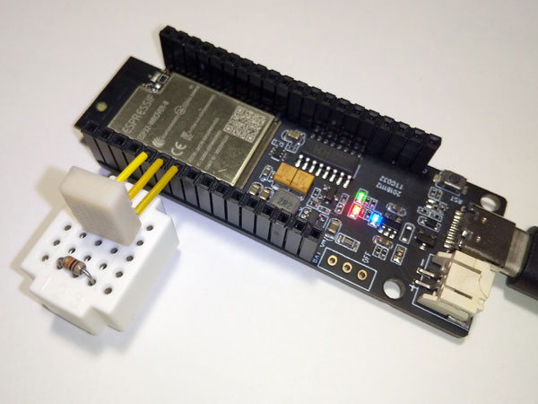
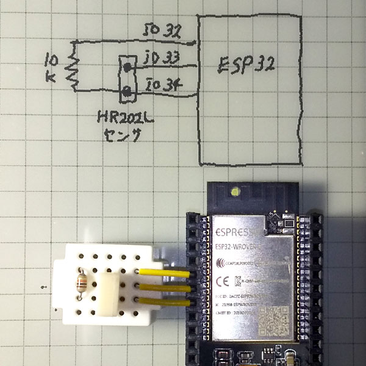
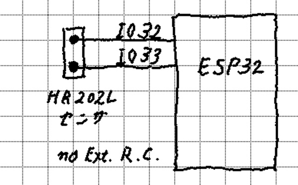
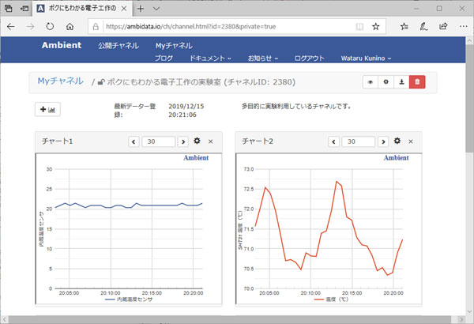

# hr202l
Example code for AOSONG HR202L on ESP32 Arduino.  

Connect humidity sensor AOSONG HR202L to ESP32, it measures temperature and humidity.  

AOSONG HR202L is a very inexpensive humidity sensor. We can buy it for $ 0.60 to $ 2. 
However, it is a little difficult to handle, so giving up accuracy makes it easy to measure.  

## ESP32 dev Board and HR202L
  

## Schematics
2 types:  

### Schematic 1: for hr202l.ino, hr202l_udp.ino, ht202l_toAmbient.ino
  
It has a reference resistor (10k Ohm) on the mini breadboard.

### Schematic 2: NO External components, for hr202l_woExRC.ino, hr202l_woExRC_udp.ino
  

Attention! NO adequate accuracy  

## Measured data on Ambient IoT Cloud Service (https://ambidata.io/)
  
The example code is in [ht202l_toAmbient](ht202l_toAmbient) folder  

## Blog Site
- 基準抵抗で測定・ブログ記事（Japanese Only）：  
    [https://bokunimo.net/blog/misc/701/](https://bokunimo.net/blog/misc/701/)  
- ESP32に直結・ブログ記事（Japanese Only）：  
    [https://bokunimo.net/blog/esp/903/](https://bokunimo.net/blog/esp/903/)  

## Copyright (c) 2019-2020 [Wataru KUNINO @ bokunimo.net](https://bokunimo.net)
